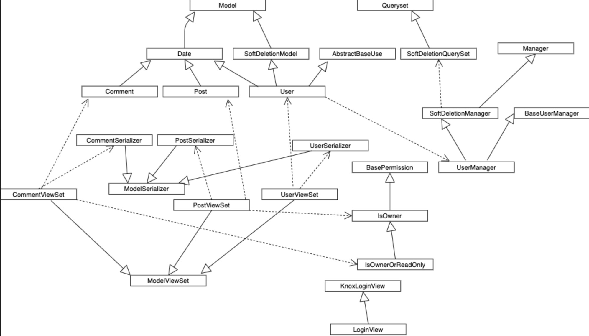
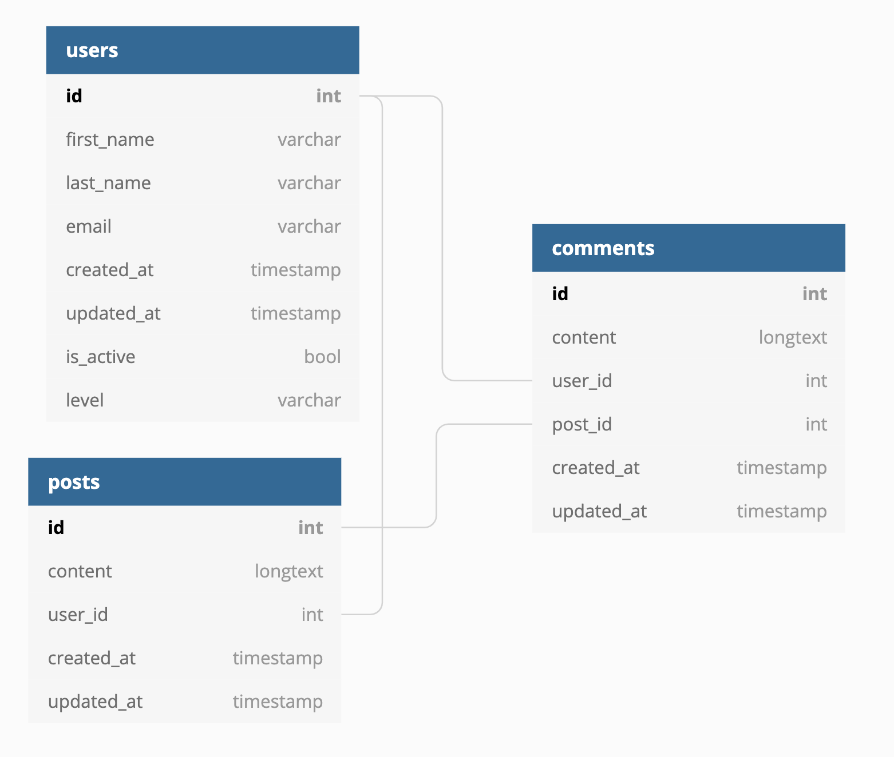

# mini-fb-api
Most of this documentation was required for a school project.

## About
This application is a simple api which supports CRUD operations on a couple of related entities. It is built using REST principles, which stands for "Representational state transfer". It uses a relational database and the SQL language, python as the primary programming language, django as the main framework and django-rest-framework(DRF) on top of django in order to simplify things and make it more scalable. It also utilises yaml for fixtures.

## Technologies used
As previously stated, python is the programming language of choice here. It is a multi-purpose interpreted language with a clean syntax that is not verbose. This makes it great for prototyping, even if the performance is far better in languages like Golang or C++.
Django and DRF allow python users to create APIs quickly that are scalable and fast if written well.
Yaml is used for fixture data as it is more readable than JSON. This data is needed for tests.
Another tool used for testing is Postman, which allows to send HTTP requests to urls(endpoints) and check the result without having to write tests.
For data persistence, PostgreSQL is used, mainly because it's what I've always used. It is also open source and it is also fast.

## Usage
There are a couple of commands that you can run:
 - ```python manage.py test```
 - ```python manage.py runserver```
 - ```python manage.py makemigrations```

## Diagrams
These are the class and database diagrams which may give you an idea about the applications' structures.



## Code structure
Following django's general structure, the code is structured in a few types of files:
- routes: these match the url from the request and connect the request to the correct view
- views: these contain the methods for each type of HTTP request and can use other type of objects
- tests
- serializers: these transform the data from the querysets(generated one way or another) to python dictionaries
- querysets: these are used to overwrite the SQL query generated by the default queryset
- permissions: classes that can check whether a request should be allowed or not
- models: maps a python class to a database table and is used to generate migrations
- migrations: are created by running the command ```python manage.py makemigrations``` and update the database structure
- managers: manage how model objects are treated
- fixtures: yaml files which contain test data

## Implementation details
The project follows a classic structure so most things are not worth mentioning.
The User model has a soft-deletion mechanism. It has a column in the database is_active. It can also be hard deleted on a certain endpoint. If soft-deleted, it acts exactly as if it was hard-deleted but it can be salvaged. The other models don't have this. The password is encrypted with sha-512, with the KnowLoginView class. The email is used as username.
